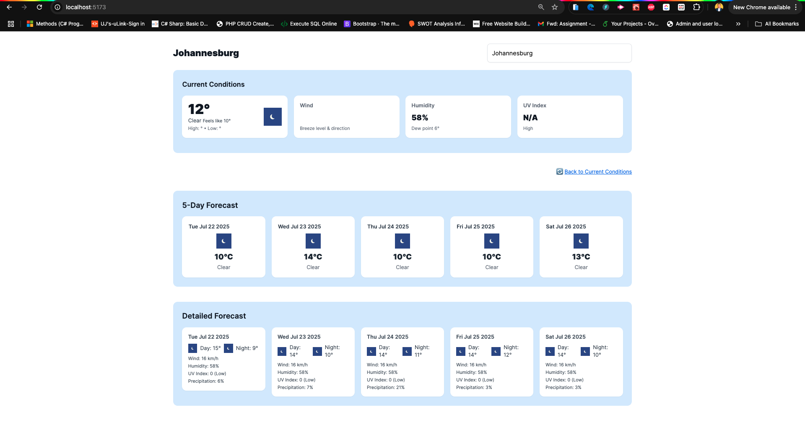

# 🌤️ Weather Forecast App

A modern weather dashboard built with **React**, **TypeScript**, **Zustand**, and the **WeatherStack API**. The app delivers a real-time weather experience with:

  - Current weather conditions
  - A 5-day basic forecast
  - A detailed 5-day forecast with extended metrics
  - Interactive card-based updates for current conditions

> 💡 Clicking on a detailed forecast card scrolls and updates the current conditions dynamically.

---

## 📸 Demo

---

## 🚀 Features

- 🔍 **Location Search** – Type a city to get instant weather updates
- 🌡️ **Current Weather Conditions**:
  - Temperature
  - Feels Like
  - Humidity
  - Wind Speed & Direction
  - UV Index
- 📆 **5-Day Forecast Overview** – Clean and simplified daily forecast
- 📊 **Detailed Forecast** – View day/night temperatures, humidity, wind, UV, and precipitation
- 🔁 **Interactive Forecast Cards** – Clicking updates the main view with smooth scroll
- ⚙️ **Zustand State Management**
- 💾 **Local Caching** – Weather results cached for 10 minutes

---

## 🛠️ Tech Stack

| Tech         | Usage                          |
|--------------|--------------------------------|
| React        | UI framework                   |
| TypeScript   | Type safety                    |
| Zustand      | Lightweight global state store |
| Tailwind CSS | Styling                        |
| Vite         | Fast bundler                   |
| WeatherStack | Weather API                    |
| Vitest       | Unit testing                   |

---

## 🗂️ Project Structure

src/
├── components/ # Reusable UI components
│ ├── CurrentConditions.tsx
│ ├── ForecastCard.tsx
│ ├── LocationSearch.tsx
│ └── WeatherCard.tsx
├── pages/
│ └── HomePage.tsx # Main weather dashboard
├── services/
│ └── weatherApi.ts # Weather API wrapper & cache
├── store/
│ └── useWeatherStore.ts # Zustand global state store
└── App.tsx

## 📦 Installation

Clone the project and install dependencies:

git clone https://github.com/your-username/weather-app.git
cd weather-app
npm install
npm run dev

## 🔐 Setup Environment Variables

  - VITE_WEATHERSTACK_API_KEY=`your_weatherstack_api_key`

## 🧠 Forecast Simulation Logic
The WeatherStack free API tier does not include 5-day forecasts. To work around this, the app:
  - Uses current weather data
  - Simulates 5-day simplified and detailed forecasts using random offsets
  - Still presents realistic variation using available metrics (e.g., humidity, wind, temperature)

## 💡 Usage Tips
  - ✅ Click a ForecastCard to scroll and update the CurrentConditions dynamically
  - 🌀 Use the 🔄 "Back to Current Conditions" link to return to real-time data
  - 💻 Responsive across devices

## 📈 Future Improvements
  - Toggle between °C and °F
  - Support international city searches
  - Persist last searched city
  - Add dark mode support
  - Add hourly forecast
  - Deploy as PWA with offline cache

## 🙌 Acknowledgements
  - WeatherStack
  - Zustand
  - Vitest
  - Tailwind CSS
